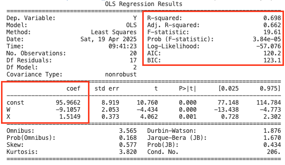

## Structure Explanation

- app.py:
  - Train a simple linear regression model
  - Provide Rest API using a Flask
  - Log the prediction to output.txt
- requirements.txt
  - lists all the Python packages your app needs and suitable version
- model.txt
  - explain the model linear regression using in app
- output.txt
  - store prediction 
- Dockerfile
  - defines the environment and execution steps
  - Docker improves reproducibility by encapsulating applications and their dependencies in containers, ensuring consistent execution across different environments. Its version control, isolation, and defined configurations enable repeatable builds, minimizing discrepancies between development and production.

## Question 1
b)  

- Estimated ATE (τ ) = -9.1057 (coef of W): participation in the carbon offset program is associated with a decrease of approximately 9.11 points in stakeholder engagement scores, holding other factors constant (like annual spending on sustainability)
- p_value = 0,000 means that the result is highly statistically significant
- The standard error of 2.053 measures the variability of the estimated coefficient, a smaller standard error indicates a more precise estimate of the effect.

c) the estimated Average Treatment Effect or ATE) can be given a causal interpretation under several key assumptions:
- Random assignment: Corporations are randomly assigned to either participate in the carbon offset program (( W = 1 )) or not (( W = 0 ))
- The participation of one corporation in the carbon offset program does not influence the engagement scores of other corporations
- No unobserved confounding: There should be no unmeasured variables that impact both treatment indicator and engagement scores
- Assume a linear relationship between the independent variables (the treatment indicator ( W ) and the covariate ( X )) and the dependent variable (the engagement score ( Y ))

## Question 2
Screenshot of test run for Docker Build and Docker Run on github Codespaces

c) Test API when W=1 and X=20, the prediction value of Y = 117,1579

Mean: when Company participates in the carbon offset program and spending $20000 annually on sustainability initiatives, it predicts that the stakeholder engagement score will be approximately 117.16. 

